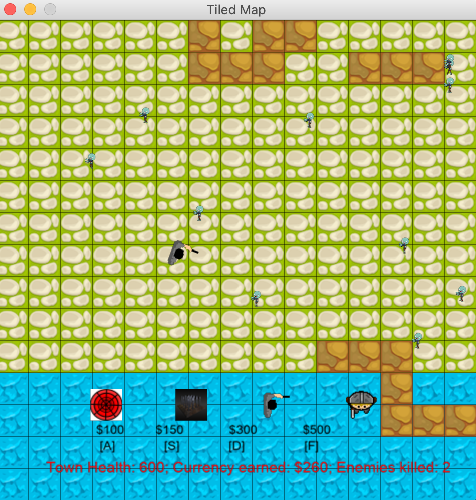
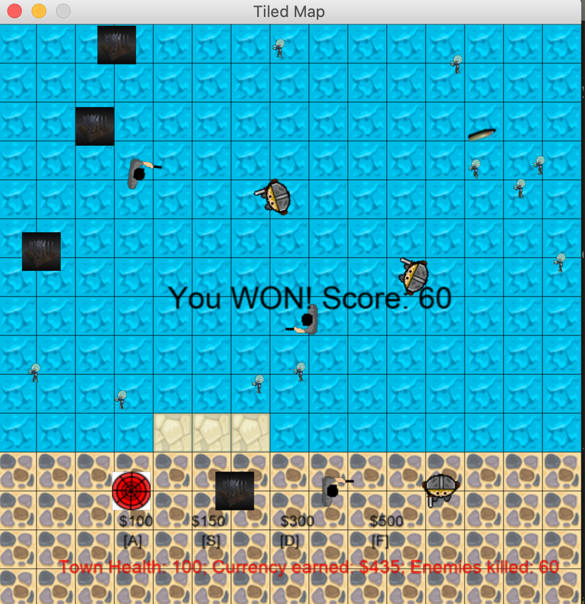

# Tower Defense Game - The Zombie Hunt

A simple tower defense game has been coded in Python using the Arcade librarby: https://github.com/pvcraven/arcade. 

Your goal is to prevent the zombies in the town from reaching their destination by building towers to defeat them. You are provided with 4 types of towers, each with a different functionality and cost (a web to slow enemies down, spikes, a shooter with a handgun, a shooter with a shotgun) to defend your town. Before the town health reaches zero, hunt 60 zombies to win. You are provided $500, to begin with, in order to buy some assets to defend your town. Each zombie you kill, you will get rewarded with money. Be strategic or else you will lose the game!

## Installation

Execute the following commands to run the game:

```
git clone https://github.com/hshastri/tower-defense-game.git
cd tower-defense-game
pip3 install arcade
python3 main.py
```

## User Interface for players

To select the tower you want to place, press the corresponding key to the tower. Using your mouse, place the tower on the desired location on the map. PS: You are only going to be able buy towers you can afford. For example in the following screenshot, since the player has enough currency to afford tower D, the player can press D on the keyboard and place the tower on the map using the mouse.



## Game Goal

If you managed to kill 60 zombies before your town health reaches zero, you should see this:


